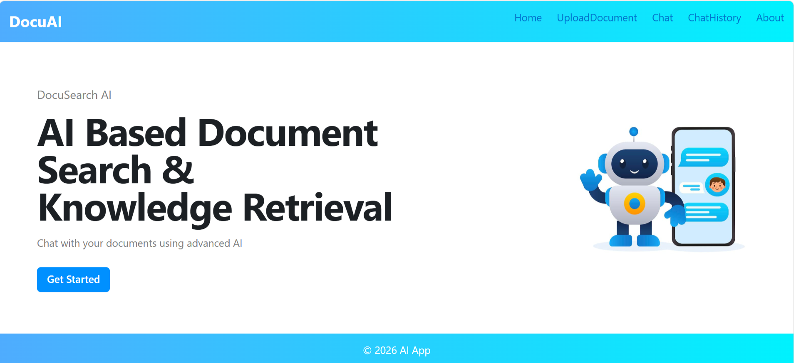
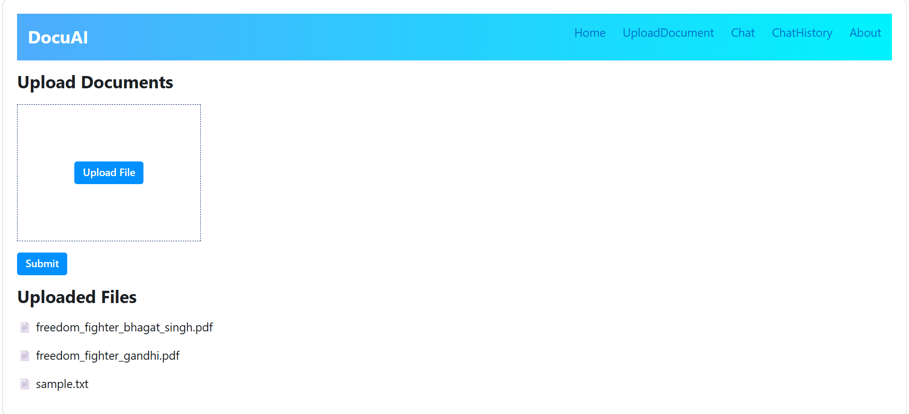
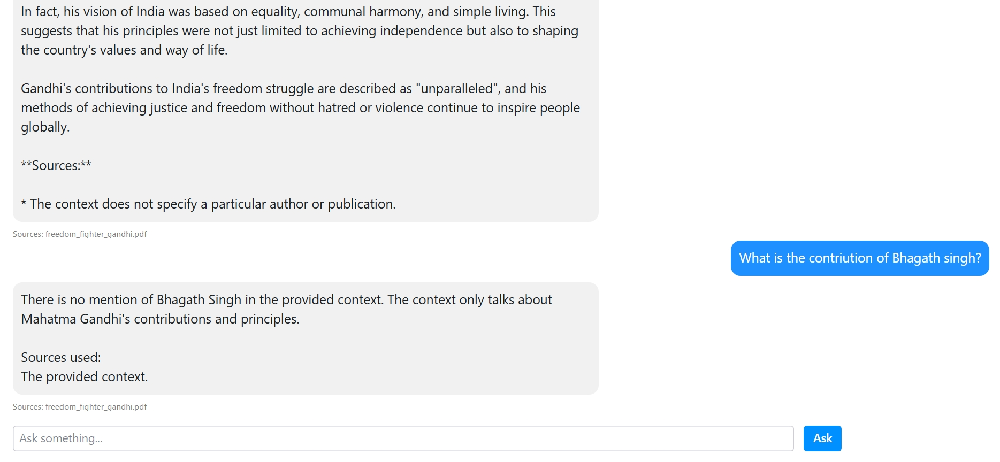
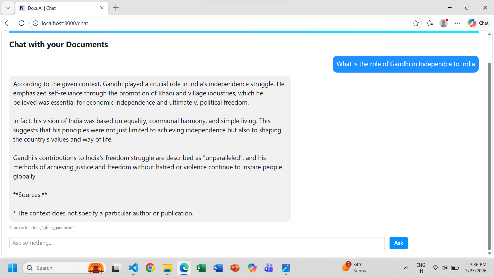
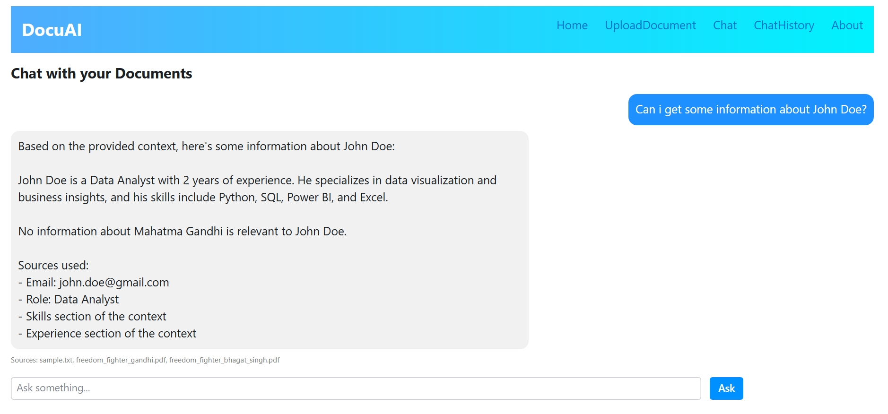
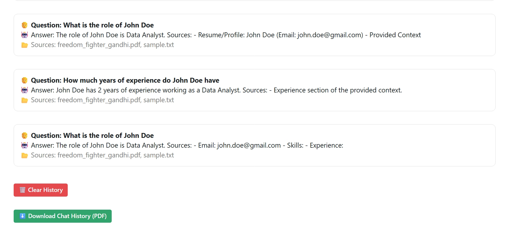
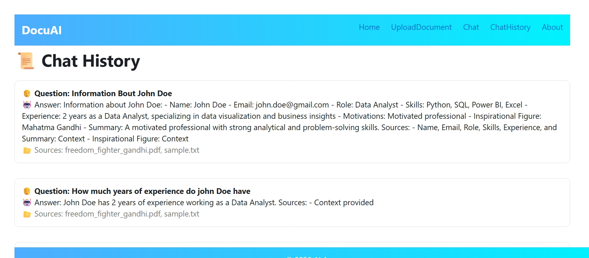
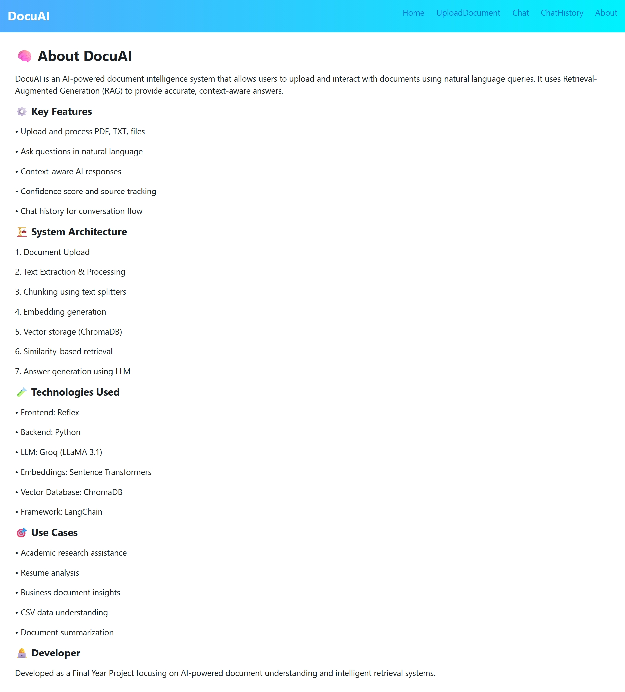

# 📄 RAG-Based Document Assistant

## 🚀 Project Overview
This project is a Retrieval-Augmented Generation (RAG) based application that allows users to upload documents and ask questions based on their content.

It uses embeddings and similarity search to retrieve relevant information and generate accurate responses.

---

## 🛠️ Tech Stack
- Python
- Reflex (UI)
- LangChain
- HuggingFace Embeddings
- FAISS (Vector Store)

---

## 📸 Working Demo
### 📊 Dashboard

### 📤 Upload Page

### 💬 Chat Interface

### 💬 Chat Interface

### 💬 Chat Interface

### 📜 History

### 📜 History

### 📜 About

---

## ✨ Features

- 📄 **Multi-Format Document Upload**  
  Supports both **PDF** and **TXT** files for flexible document ingestion.

- 🔍 **Intelligent Text Processing**  
  Automatically splits documents into smaller chunks for efficient retrieval.

- 🧠 **Embedding Generation**  
  Converts document content into vector embeddings using **HuggingFace models**.

- ⚡ **Semantic Search (Cosine Similarity)**  
  Retrieves the most relevant content based on user queries.

- 💬 **Interactive Chat Interface**  
  Users can ask natural language questions and get context-aware responses.

- 📚 **Context-Aware Answer Generation**  
  Uses retrieved document chunks to generate accurate and meaningful answers.

- 🗂️ **Chat History Management**  
  Stores previous queries and responses for easy reference.

- 🎯 **Real-Time Response System**  
  Provides quick and efficient answers with minimal delay.

- 🖥️ **User-Friendly UI (Reflex)**  
  Clean and responsive interface for smooth user interaction.

---
---

## ▶️ How to Run the Project

### 1️⃣ Clone the Repository

---

### 2️⃣ Create Virtual Environment (Optional but Recommended)
python -m venv venv  

Activate the environment:

- Windows:
venv\Scripts\activate  

- Mac/Linux:
source venv/bin/activate  

---

### 3️⃣ Install Dependencies
pip install -r requirements.txt  

---

### 4️⃣ Setup Environment Variables

Create a `.env` file in the root directory and add the following:

GROQ_API_KEY=your_groq_api_key  
HF_TOKEN=your_huggingface_token  

---

### 5️⃣ Run the Application
reflex run  

---

### 6️⃣ Open in Browser
http://localhost:3000  

---

